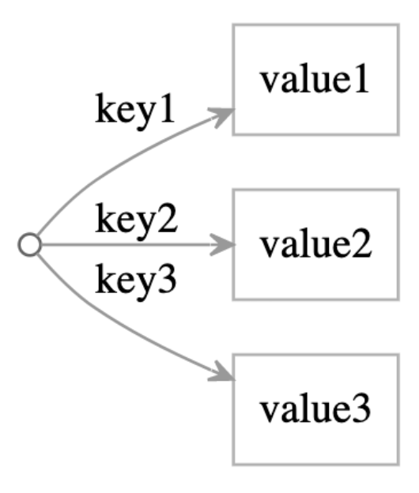

```js
// Display all the values of an in-memory object.
const obj = {
  Alice: "Hello, Alice.",
  Bob: "Hello, Bob.",
  Carol: "Hello, Carol.",
};

for (const key in obj) {
  const value = obj[key];
  console.log(value);
}
```

Running the above displays:

```sh
Alice: Hello, Alice.
Bob: Hello, Bob.
Carol: Hello, Carol.
```

Now suppose we have the same data in three files in a folder:

```shell
$ ls people
Alice
Bob
Carol
$ cat Alice
Hello, Alice.
```

```js
// Display all the file contents in a given folder.
import * as fs from "fs/promises";
import path from "path";
import { fileURLToPath } from "url";

// Get a reference to the folder.
const moduleFolder = path.dirname(fileURLToPath(import.meta.url));
const filesFolder = path.resolve(moduleFolder, "../people");

// Read the list of files in that folder.
const files = await fs.readdir(filesFolder);

// For each file, read the file's contents.
const buffers = await Promise.all(
  files.map(async (fileName) => {
    const filePath = path.join(filesFolder, fileName);
    const buffer = await fs.readFile(filePath);
    return buffer;
  })
);

// Display the contents of all the files.
for (const buffer of buffers) {
  console.log(buffer.toString());
}
```

Running the above displays:

```sh
Alice: Hello, Alice.
Bob: Hello, Bob.
Carol: Hello, Carol.
```

In both cases, we get the same graph:


